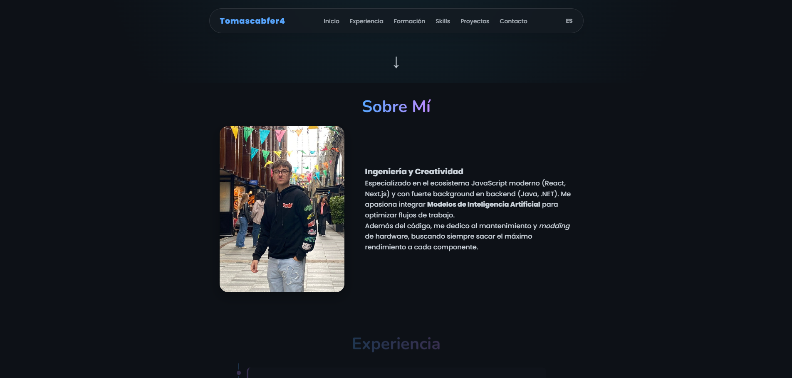
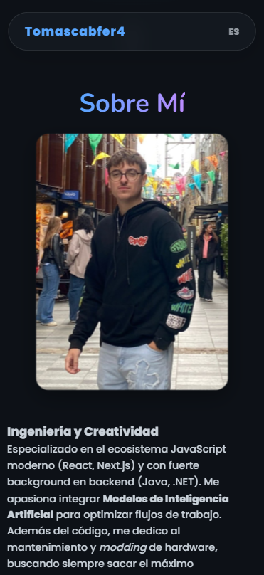

# Portafolio Web - Tomás Cabello Fernández

**Finalidad:** Trabajo del Tema 4 para Desarrollo de Interfaces Web (DIW).  
Demostración de competencias en HTML5, CSS3 avanzado, animaciones y diseño responsivo sin uso de JavaScript.

## 🔗 Enlace al Despliegue
> **https://portfolio-tomascabello.pages.dev/**

---

## 📱 Capturas de Pantalla

### Versión Escritorio

### Versión Móvil

---

## 📝 Descripción de Apartados

1. **Hero Section:** Presentación con animación de escritura CSS y listado de tecnologías con badges.
2. **Sobre Mí:** Tarjeta interactiva con efecto **Flip 3D** (CSS `transform: rotateY`). Muestra mi perfil profesional y aficiones.
3. **Experiencia:** Timeline vertical maquetado con CSS Grid/Flexbox para mostrar mi trayectoria.
4. **Skills:** Tarjetas con efecto **Glassmorphism** (vidrio esmerilado) e iconos SVG.
5. **Proyectos:** Grid responsive con tarjetas que incluyen efectos visuales avanzados:
    * *Neón:* Bordes brillantes animados.
    * *Glass:* Transparencias.
    * *Clean:* Diseño minimalista.
6. **Contacto:** Formulario estilizado con efecto de cambio de tarjeta (Login/Registro) usando el "Checkbox Hack" (CSS puro).

---

## 🛠️ Requisitos Técnicos Cumplidos
* **Sin JavaScript:** Toda la interactividad es CSS puro.
* **Imágenes:** Uso de formatos de nueva generación (AVIF, WEBP) y etiqueta `<picture>`.
* **Modo Oscuro:** Implementado con variables CSS (`prefers-color-scheme`).
* **Animaciones:** Scroll-driven animations y transiciones suaves.